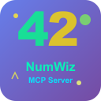

<p align="center">
  
</p>

<h1 align="center">NumWiz MCP Server</h1>

Self-contained MCP server providing 8 tools for number facts, trivia, and mathematical properties. Ships with a rich bundled dataset covering 150+ trivia numbers, 150+ math numbers, 366 dates (4-5 facts each including Indian history), and 200+ historical years — no external API required.

## Tools

### `numwiz_trivia` — Get trivia fact about a number
```json
{ "number": 42 }
```
**Example response:**
```
🎲 Number Trivia: 42

42 is the number of laws of cricket.

Type: trivia
Source: numbersapi.com
```

### `numwiz_math` — Get math fact about a number
```json
{ "number": 7 }
```
**Example response:**
```
🔢 Number Math: 7

7 is the number of frieze groups.

Type: math
Source: numbersapi.com
```

### `numwiz_date` — Get fact about a date
```json
{ "month": 8, "day": 15 }
```
**Example response:**
```
📅 Date: 15

On August 15, 1947, India gained independence from British rule, with Jawaharlal Nehru becoming the first Prime Minister.

Type: date
Source: numbersapi.com
```

### `numwiz_year` — Get fact about a year
```json
{ "year": 1947 }
```
**Example response:**
```
📜 Year: 1947

1947 India and Pakistan gained independence from British rule.

Type: year
Source: numbersapi.com
```

### `numwiz_random` — Get random number fact
```json
{ "type": "trivia" }
```
Returns a random fact. Types: `trivia`, `math`, `date`, `year`.

### `numwiz_batch` — Get facts for multiple numbers
```json
{ "numbers": [1, 7, 42], "type": "trivia" }
```
**Example response:**
```
🎲 Batch Trivia Facts

• 1: 1 is the number of dimensions in a line
• 7: 7 is the number of notes in the traditional Western major scale
• 42: 42 is the number of laws of cricket

Type: trivia
Source: numbersapi.com
```

### `numwiz_range` — Get facts for a number range
```json
{ "start": 1, "end": 5, "type": "trivia" }
```
Returns facts for each number in range (max 20 apart).

### `numwiz_is_interesting` — Check if a number is interesting
```json
{ "number": 64 }
```
**Example response:**
```
🔍 Number Analysis: 64

**Mathematical Properties**:
• Perfect square (√64 = 8)
• Power of 2

**Trivia**: 64 is the number of squares on a chess board
**Math**: 64 is a perfect cube (4³)

Source: numbersapi.com
```

## Architecture

The server uses a **bundled local dataset** — all facts are compiled into the package at build time. No network requests are made at runtime, making it fast, reliable, and fully offline-capable.

## Integration

### Claude Desktop

Add to `claude_desktop_config.json`:
```json
{
  "mcpServers": {
    "numwiz": {
      "command": "npx",
      "args": ["numwiz-mcp-server"]
    }
  }
}
```

### Cursor

Add to `.cursor/mcp.json` in your project root:
```json
{
  "mcpServers": {
    "numwiz": {
      "command": "npx",
      "args": ["numwiz-mcp-server"]
    }
  }
}
```

### VS Code (manual)

Add to `.vscode/mcp.json` in your workspace:
```json
{
  "servers": {
    "numwiz": {
      "type": "stdio",
      "command": "npx",
      "args": ["numwiz-mcp-server"]
    }
  }
}
```

Or install the **NumWiz MCP Server** extension from the VS Code Marketplace for automatic registration.

## License

MIT
